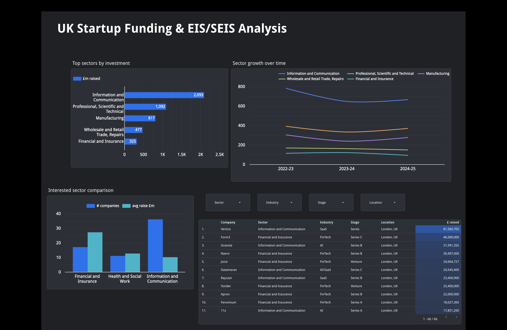

# UK Startup Funding & EIS/SEIS Analysis

A SQL data project that builds a relational database of UK startup funding, combines it with official HMRC tax-relief statistics, and surfaces the results in an interactive Looker Studio dashboard.

> **[▶ View the live interactive dashboard](https://datastudio.google.com/s/kj0VwYixLug)**




---

## What this project is

I set out to answer a practical question: **where is the money going in UK startups, and how does a hand-tracked sample of real companies compare to the official national picture?**

To do that, I combined two very different datasets in one MySQL database:

- **A startup funding tracker** — 96 real UK startups with names, locations, industries, funding stages, amounts raised, and lead investors. This is granular and real, but it's a small, London-heavy sample.
- **Official HMRC EIS/SEIS statistics** — the government's national figures on companies raising money through the Enterprise Investment Scheme (EIS) and Seed Enterprise Investment Scheme (SEIS), broken down by sector, region, investment size, and year. This is complete and authoritative, but anonymous and aggregate.

The interesting analytical move is putting the two side by side: using the national data to see which sectors are large and growing, and the tracked-company data to see *which specific companies* sit inside those sectors and at what stage. The whole thing is then presented in a dashboard designed so a viewer can explore both lenses without confusing one for the other.

---

## The dashboard

The dashboard is the centrepiece of this project — it's where the database work turns into something a non-technical person can actually read and act on. It was built in **Looker Studio** (formerly Google Data Studio) and is designed around a deliberate principle: **separate the national picture from the tracked sample, and label both clearly**, so nobody mistakes 96 hand-picked companies for the whole UK.

### How the dashboard is structured

The layout is split into two zones, each under its own banner:

**Zone 1 — National picture (HMRC data).** The top of the dashboard uses the official government statistics. These tiles answer the big-picture questions: which sectors attract the most investment across the whole UK, and whether each sector is growing or shrinking over time. Because this data covers every EIS/SEIS company nationally, it's the authoritative view of where capital is actually flowing.

**Zone 2 — Tracked startups (the 66-company sample).** The lower half uses the hand-tracked company data. These tiles get specific and personal: which named companies you could actually work for or pitch to, what funding stage they're at, and how a few key sectors compare on ease of entry. This is the "street-level" view that the aggregate national data can't give you.

Keeping these two zones visually separated — with headers that name the data source — is a deliberate design decision. It signals to anyone reading the dashboard that these are two different lenses on the same theme, and it prevents the common mistake of reading a small sample as if it were the national total.

### The dashboard tiles, and the questions each one answers

**1. Top sectors by investment (national).**
A horizontal bar chart of total EIS/SEIS funding by sector, drawn from the HMRC data. Horizontal bars were chosen because the official SIC sector names are long ("Information and Communication", "Professional, Scientific and Technical") and read far more cleanly on a vertical axis. The chart is limited to the top few sectors so the story — where the money concentrates — is legible at a glance rather than buried under seventeen categories. *Answers: which sectors attract the most investment overall?*

**2. Sector growth over time (national).**
A time-series line chart with tax year on the x-axis and one line per sector. A rising line means a sector is heating up; a falling line means it's cooling. This turns the static "which sector is big" question into the more forward-looking "which sector is *rising*", which is arguably the more useful signal for anyone deciding where to focus. *Answers: is a sector growing or shrinking?*

**3. Three-sector comparison (tracked sample).**
A comparison table pitting three focus sectors — Financial and Insurance, Information and Communication, and Health and Social Work — against each other on several "ease of entry" proxies: number of tracked companies, how many are early-stage (Pre-Seed/Seed), average raise, and total raised. There's no single "easiest" column in the data, so the dashboard shows several measures and lets the viewer weigh them: more companies means more openings, more early-stage companies means a lower barrier to entry, and a higher average raise means better-resourced employers. *Answers: which sector would be easiest to enter?*

**4. Companies you could work for or pitch (tracked sample).**
The most directly actionable tile: a filterable table of named companies, with sector, stage, location, and amount raised. Interactive **drop-down controls** let a viewer filter live by sector and by funding stage, so someone interested in, say, Seed-stage FinTech can narrow the whole table to exactly that in two clicks. This is where the aggregate analysis becomes a concrete list of real companies to approach. *Answers: which specific companies could I work for or pitch to?*

### How the dashboard connects to the data

The dashboard was built two ways during development, and both are worth mentioning because they demonstrate different skills:

- **Live MySQL connection (proof of concept).** I connected Looker Studio directly to the local MySQL database using a secure TCP tunnel (ngrok) and a dedicated read-only database user. This proved out a genuine live pipeline — MySQL → tunnel → BI tool — where the dashboard reflects the database in real time.
- **CSV / Google Sheets (the published version).** Because a laptop-hosted tunnel isn't a stable, always-on link, the **published, shareable** version of the dashboard is backed by CSV exports of the analysis queries (connected via Google Sheets). This is what makes the live link above work for anyone, at any time, without my machine being on.

This split is a deliberate, honest engineering choice: the live connection shows the pipeline is real, while the CSV-backed publish makes the result durable and shareable.

---

## Database design

The database follows a lookup-and-fact structure, which keeps the data clean and the analysis queries readable.

**Lookup (dimension) tables** hold the shared, reusable categories:

- `sector` — the 17 official SIC-based industry categories
- `region` — the 13 UK government office regions
- `scheme` — EIS and SEIS
- `year` — the three tax years (2022-23, 2023-24, 2024-25)
- `investment_size_band` — the 22 investment-size bands

**Fact tables** hold the measured numbers, each row keyed to the lookups above:

- `company` — the 96 tracked startups (the sample data)
- `funding_by_sector` — national companies-raising and amounts, per sector / scheme / year
- `funding_by_region` — the same, per region
- `funding_by_size_band` — the same, per investment-size band
- `advance_assurance` — HMRC advance-assurance application outcomes

A schema diagram is included in `docs/schema_diagram.png` *(generate one from MySQL Workbench via Database → Reverse Engineer and drop it here).*

### The join that makes the two datasets work together

The tracked-company data and the national data don't share a row-level key — one is individual companies, the other is pre-aggregated national totals. They meet instead at the **dimension level**: both are tied to the same `sector` (and `year`, `region`) lookups. To make that possible, each tracked company's informal industry label (e.g. "FinTech", "AI/SaaS") was mapped to the correct formal SIC sector. That mapping is the hinge that lets the dashboard compare "my tracked FinTech startups" against "the official Financial and Insurance totals for the same year."

---

## Key findings

- **Information and Communication dominates UK startup funding** by a wide margin — it's the SIC category that captures most software, AI, and digital startups, and it leads both the national figures and the tracked sample.
- **London is overwhelmingly the centre of gravity** in the tracked data, which is worth reading as a property of the sample rather than a complete national truth.
- **The tracked companies skew heavily early-stage** (Seed and Pre-Seed), reflecting the kind of young companies the tracker captures.
- **Sectors differ sharply on "ease of entry" depending on the measure** — Information and Communication has the most companies (more openings), while Financial and Insurance shows much higher average raises (better-resourced employers). Which sector is "easiest" genuinely depends on what a person is optimising for.

---

## Decisions and limitations

I've documented the judgment calls deliberately, because how ambiguity is handled matters as much as the results.

- **Sample vs national.** The 96 tracked companies are a small, curated, London-heavy sample. They are not a statistically representative slice of UK startups, and the dashboard labels them as a sample throughout. Comparisons against the national HMRC figures are **indicative, not exact** — the tracked companies aren't necessarily EIS/SEIS companies, while the national data is EIS/SEIS-only.
- **Sector mapping is a judgment call.** Informal industry labels were mapped to formal SIC sectors. Most are clean, but some are genuinely arguable — for example, BioTech could sit in Health or in Manufacturing, and PropTech could sit in Construction or Real Estate. These were mapped consistently and are flagged here rather than hidden.
- **Suppressed values are kept as NULL, not zero.** Where HMRC suppressed a small figure (its `<5` / `<1` markers), the value is stored as `NULL` — "disclosed but too small to state" — which is meaningfully different from a true zero. This distinction is preserved throughout.
- **"Easiest to enter" is a proxy, not a fact.** No dataset contains a literal "ease of entry" measure. The dashboard uses company count, early-stage share, and average raise as reasonable stand-ins, and presents them together rather than collapsing them into a single misleading score.
- **A short time series.** Only three tax years of national data were loaded, so "growth" is a direction across three points — a useful hint, not a definitive long-term trend.

---

## Tech stack

- **MySQL** — database design, loading, and transformation
- **MySQL Workbench** — schema modelling and query development
- **Looker Studio** — the interactive dashboard
- **Google Sheets** — the stable data source behind the published dashboard
- **ngrok** — the TCP tunnel used for the live-connection proof of concept

---

## Repository structure

```
uk-startup-funding-analysis/
├── README.md
├── sql/
│   ├── 01_schema_and_setup.sql        # create database, tables, lookups, load company data
│   ├── 02_company_sector_mapping.sql  # map company industries to SIC sectors + foreign key
│   ├── 03_load_gov_data.sql           # load all HMRC national statistics
│   ├── 04_data_quality_checks.sql     # row-count and integrity verification
│   └── 05_analysis_queries.sql        # the cross-dataset analysis queries
├── data/
│   └── (CSV exports of the analysis query results)
├── dashboard/
│   ├── dashboard_overview.png         # screenshots of the dashboard
│   └── dashboard.pdf                  # static export
└── docs/
    └── schema_diagram.png
```

---

## Data sources

- **UK startup funding tracker** — the 96-company sample dataset.
- **HMRC — Enterprise Investment Scheme and Seed Enterprise Investment Scheme statistics** — the official national tax-relief figures published by HM Revenue & Customs.
